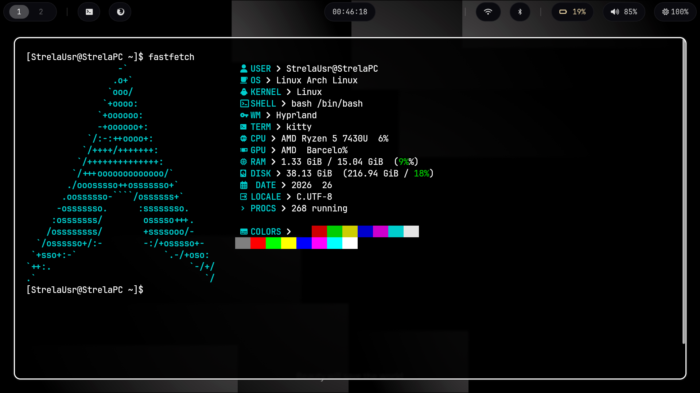
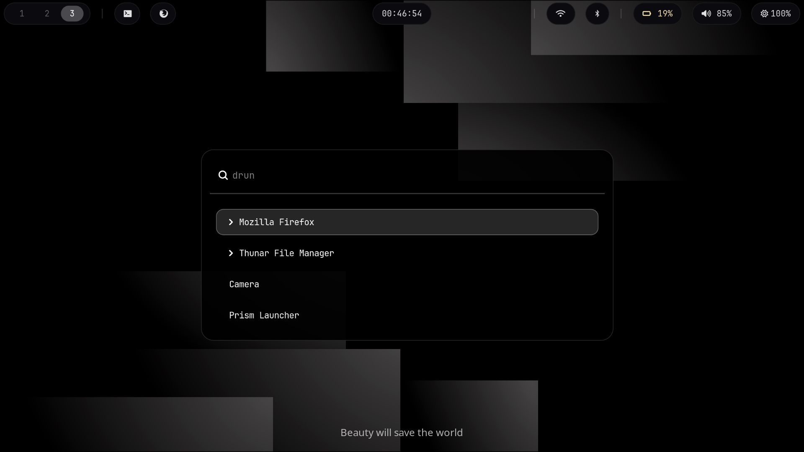

# 🧑‍💻 StrelaTech Dotfiles

Мои персональные конфигурационные файлы для окружения **Hyprland** на **Arch Linux**.
Минимализм, производительность и полный контроль над системой.




---

## 🎨 Дизайн

- Минималистичная черно-белая цветовая схема.
- Чистый, ненавязчивый интерфейс.
- Легкая замена обоев через файл `hypr/wall.png`.

---

## ⌨️ Горячие клавиши

| Комбинация        | Действие                   |
|-------------------|----------------------------|
| `Super + T`       | Открыть терминал (Kitty)   |
| `Super + E`       | Открыть файловый менеджер  |
| `Super + P`       | Сделать скриншот           |
| `Super + R`       | Открыть лаунчер (Wofi)     |
| `Super + Q`       | Закрыть активное окно      |
| `Super + M`       | Выйти из Hyprland          |

---

## 📦 Зависимости

Перед установкой убедитесь, что у вас установлены следующие пакеты:

```

hyprland wayland wlroots nm-applet waybar hyprpaper kitty nemo wofi 
wpctl brightnessctl playerctl grim slurp nmtui hyprshutdown firefox 
blueman-manager networkmanager pavucontrol pamixer pulseaudio

```

> **Примечание:** Все зависимости доступны в официальных репозиториях Arch Linux и AUR.

---

## 📁 Структура проекта

```
.
├── assets/
│   ├── screen.png          # Скриншот рабочего стола
│   └── screen2.png         # Дополнительный скриншот
├── fastfetch/
│   └── config.jsonc        # Конфигурация Fastfetch
├── hypr/
│   ├── hyprland.lua        # Основной конфиг Hyprland (Lua)
│   ├── hyprpaper.conf      # Настройки обоев Hyprpaper
│   └── wall.png            # Текущие обои
├── kitty/
│   └── kitty.conf          # Конфигурация терминала Kitty
├── waybar/
│   ├── config              # Настройки панели Waybar
│   └── style.css           # Стили Waybar
├── wofi/
│   └── style.css           # Стили лаунчера Wofi
├── LICENSE                 # Лицензия MIT
├── README.md               # Этот файл
└── setup.sh                # Скрипт автоматической установки

```

---

## 🔧 Установка

### Автоматическая (скрипт `setup.sh`)

1. Клонируйте репозиторий:
   ```bash
   git clone https://github.com/StrelaTech/dotfiles.git
   cd dotfiles
```

2. Запустите установку:
   ```bash
   ./setup.sh
   ```

Ручная установка

Если вы хотите выборочно установить конфигурации:

```bash
cp -r fastfetch ~/.config/
cp -r hypr ~/.config/
cp -r kitty ~/.config/
cp -r waybar ~/.config/
cp -r wofi ~/.config/
```

---

🖼️ Смена обоев

Просто замените файл hypr/wall.png на свое изображение (сохранив имя файла).

---

📝 Примечания

· Конфигурация протестирована только на Arch Linux.
· Скрипт установки не устанавливает зависимости автоматически.
· По всем вопросам — открывайте Issue или пишите в Telegram: @streladirect_bot

---

📄 Лицензия

Распространяется под лицензией MIT. Подробности в файле LICENSE.
